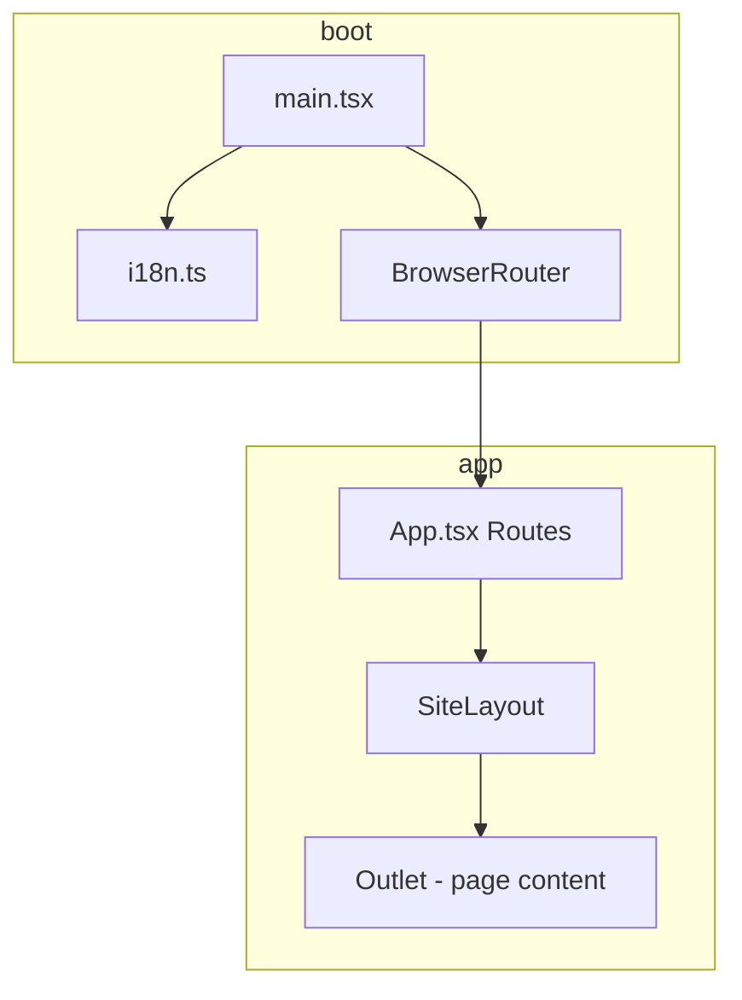

# Dantex

Marketing and product site for **Dantex**: a Spanish/English single-page application built with React. It presents industry verticals (energy, finance, healthcare, and others), engineering and AI consulting services, and the **Dantex Lab** offering under AI consulting.

## Tech stack

| Layer | Choice |
|--------|--------|
| Build | [Vite](https://vitejs.dev/) 6 |
| UI | [React](https://react.dev/) 19, [TypeScript](https://www.typescriptlang.org/) |
| Routing | [React Router](https://reactrouter.com/) 7 |
| Styling | [Tailwind CSS](https://tailwindcss.com/) 4 (`@tailwindcss/vite`) |
| Components | [shadcn/ui](https://ui.shadcn.com/) (Base Nova), [Base UI](https://base-ui.com/), [Lucide](https://lucide.dev/) icons |
| Motion | [Framer Motion](https://www.framer.com/motion/) |
| 3D | [React Three Fiber](https://docs.pmnd.rs/react-three-fiber/), [Drei](https://github.com/pmndrs/drei), [Three.js](https://threejs.org/) |
| Carousels | [Swiper](https://swiperjs.com/) |
| i18n | [i18next](https://www.i18next.com/) + [react-i18next](https://react.i18next.com/) |

Path alias: `@/` → `src/` (see `vite.config.ts`).

## Project layout

```
src/
├── App.tsx                 # Route definitions (nested under SiteLayout)
├── main.tsx                # React root, BrowserRouter, i18n import
├── i18n.ts                 # i18next init, locale bundles, language persistence
├── index.css               # Global styles / Tailwind entry
├── components/             # Shared UI: layout, nav, carousels, 3D, shadcn wrappers
│   ├── site-layout.tsx     # Shell: header, mega menus, footer, <Outlet />
│   ├── nav-mega-menus.tsx
│   └── ui/                 # Button, Card, Input, NavigationMenu, etc.
├── pages/                  # One module per top-level route
│   ├── home-page.tsx
│   ├── engineering-page.tsx
│   ├── agtech-page.tsx
│   ├── ai-consulting-services/
│   ├── dantex-lab/         # Nested under AI consulting in the IA
│   ├── energy/, finance/, foodtech/, govtech/, healthcare/
│   ├── sports-entertainment/
│   └── industry-shared/    # Sections reused across verticals (e.g. NVIDIA, contact)
├── locales/
│   ├── en/                 # JSON namespaces merged into `translation`
│   └── es/
├── lib/
│   └── utils.ts            # `cn()` and shared helpers
└── svgs/                   # Inline SVG React components
```

- **Pages** typically compose **sections** (hero, content blocks, contact) colocated under `pages/<area>/sections/`.
- **Copy** lives in `locales/<lang>/*.json`; namespaces are merged in `i18n.ts` so keys stay grouped by feature (e.g. `home`, `navMega`, `dantexLab`).

## Architecture overview



- **Shell pattern**: All public routes render inside `SiteLayout`, which owns global chrome (navigation with mega menus, language switcher, background, footer) and renders child routes via `<Outlet />`.
- **No backend in-repo**: The app is a static SPA; forms and search are presentational unless wired to external APIs elsewhere.
- **Internationalization**: Default language is **Spanish** (`es`); **English** (`en`) is supported. The chosen language is stored in `localStorage` under `dantex-lang`, and `document.documentElement.lang` is updated on change.

## Routes

| Path | Page |
|------|------|
| `/` | Home |
| `/engineering` | Engineering |
| `/agtech` | Agtech |
| `/energy` | Energy |
| `/finance` | Finance |
| `/foodtech` | Foodtech |
| `/govtech` | Govtech |
| `/healthcare` | Healthcare |
| `/sports-entertainment` | Sports & entertainment |
| `/ai-consulting-services` | AI consulting services |
| `/ai-consulting-services/dantex-lab` | Dantex Lab |

## Scripts

```bash
npm install
npm run dev      # Vite dev server
npm run build    # Typecheck + production build
npm run preview  # Serve production build locally
npm run lint     # ESLint
```

## Requirements

- **Node.js** compatible with Vite 6 / TypeScript 6 (use a current LTS version).

---

*Internal name in `package.json`: `dantex`.*
